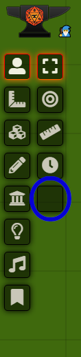
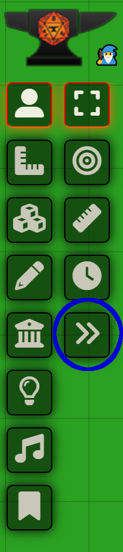

# Pf2e Display Actions

Displays Pathfinder2e action and reaction buttons.

This module supports [Bug Reporter](https://github.com/League-of-Foundry-Developers/bug-reporter).

## Usage

Click on this Button in the actors tab. 

This should get you your action display 

## Changelog
#### v 1.5.0
- added Show woth Permissions button for colaboration 
#### v 1.6.0
- added ability to connect a app window with a token
- added basic handling of conditions related to actions
##### v 1.6.1
- some small improvements to title logic
#### v 1.7.0
- added Duplication button in the header
## Roadmap
- make the amount of actions and reactions based on the selected token
    - include better handling
- beautify the Dialog
- find a icon for the sidebar
- better titles

## Credits
- I used BringingFire's [Blog](https://bringingfire.com/blog/intro-to-foundry-module-development) and respective [template](https://github.com/BringingFire/foundry-module-ts-template)

- Module [FVTT-SelectiveShow](https://github.com/moo-man/FVTT-SelectiveShow) under is of the MIT License
